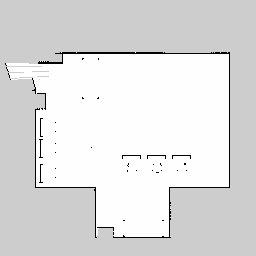
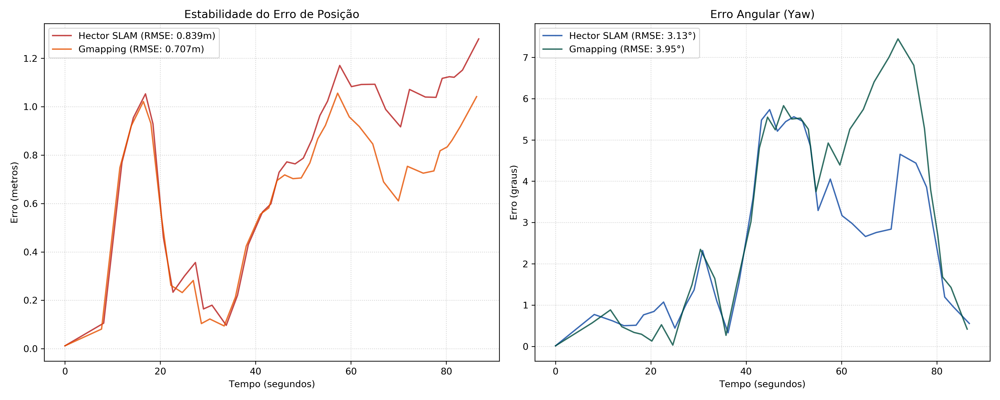

# Mapeamento e Localização com SLAM + AMCL

## Base

Esta atividade utiliza como infraestrutura o repositório **[lar-deeufba/lar_gazebo](https://github.com/lar-deeufba/lar_gazebo)**, desenvolvido pelo Laboratório de Automação e Robótica (LAR) do DEE/UFBA. Este repositório fornece:

- O **modelo 3D do laboratório LAR** para simulação no Gazebo
- O **robô Husky** configurado para o ambiente
- Os **scripts de container Docker** (`build.sh`, `run_husky.sh`, `shell.sh`) que encapsulam todo o ambiente ROS Noetic

---

## Objetivo

Gerar mapas do ambiente de simulação usando dois algoritmos de SLAM (**GMapping** e **Hector SLAM**), executar o **AMCL** sobre cada mapa gerado e comparar a pose estimada com o ground truth fornecido pelo Gazebo.

---

## Visão Geral

```
sensores_laboratorio.bag      → Bag usada para gerar os mapas
bag_teste_localizacao.bag     → Bag usada para rodar o AMCL
resultados_amcl_gmapping.bag  → Gravação dos resultados com mapa do GMapping
resultados_amcl_hector.bag    → Gravação dos resultados com mapa do Hector SLAM
```

> 📦 **Download das bags:** [Google Drive](https://drive.google.com/drive/folders/1oZlZIQPvSXabbZ5R1QXDrxHbLTg5vA5T?usp=sharing)
>
> Coloque as bags de geração de mapas e de localização e em uma nova pasta `/ws/src/lar_gazebo/bags/` dentro do container antes de executar os passos abaixo.

---

## Parte 1 — Geração de Mapas

### 1.1 Gravar a bag de sensores (caso não tenha)

Abra 3 terminais:

**Terminal 1 — Robô no mundo:**
```bash
cd ~/[PASTA PRINCIPAL]
./scripts/run_husky.sh
```

**Terminal 2 — Gravação da bag:**
```bash
cd ~/[PASTA PRINCIPAL]
./scripts/shell.sh
cd /ws/src/lar_gazebo/bags/
rosbag record /front/scan /odometry/filtered /tf /tf_static -O [NOME DA BAG].bag
```

**Terminal 3 — Teleop:**
```bash
cd ~/[PASTA PRINCIPAL]
./scripts/shell.sh
rosrun teleop_twist_keyboard teleop_twist_keyboard.py
```

Navegue pelo ambiente até cobrir bem o espaço, depois encerre a gravação com `Ctrl+C` no Terminal 2.

---

### 1.2 Gerar mapa com GMapping

**Terminal 1 — roscore:**
```bash
cd ~/[PASTA PRINCIPAL]
./scripts/shell.sh
roscore
```

**Terminal 2 — GMapping:**
```bash
cd ~/[PASTA PRINCIPAL]
./scripts/shell.sh
rosparam set use_sim_time true
rosrun gmapping slam_gmapping scan:=front/scan _base_frame:=base_link _odom_frame:=odom _map_frame:=map
```

**Terminal 3 — Reproduzir a bag:**
```bash
cd ~/[PASTA PRINCIPAL]
./scripts/shell.sh
cd /ws/src/lar_gazebo/bags/
rosbag play --clock [NOME DA BAG].bag
```

**Terminal 4 — Salvar o mapa (após a bag terminar):**
```bash
cd ~/[PASTA PRINCIPAL]
./scripts/shell.sh
cd /ws/src/lar_gazebo/maps/
rosrun map_server map_saver -f mapa_gmapping
```

> Serão gerados os arquivos `mapa_gmapping.pgm` e `mapa_gmapping.yaml`.

**Mapa gerado pelo GMapping:**


---

### 1.3 Gerar mapa com Hector SLAM

**Terminal 1 — roscore:**
```bash
cd ~/[PASTA PRINCIPAL]
./scripts/shell.sh
roscore
```

**Terminal 2 — Hector SLAM:**
```bash
cd ~/[PASTA PRINCIPAL]
./scripts/shell.sh
rosparam set use_sim_time true
roslaunch lar_gazebo hector_slam.launch
```

**Terminal 3 — Reproduzir a bag:**
```bash
cd ~/[PASTA PRINCIPAL]
./scripts/shell.sh
cd /ws/src/lar_gazebo/bags/
rosbag play --clock [NOME DA BAG].bag
```

**Terminal 4 — Salvar o mapa (após a bag terminar):**
```bash
cd ~/[PASTA PRINCIPAL]
./scripts/shell.sh
cd /ws/src/lar_gazebo/maps/
rosrun map_server map_saver -f mapa_hector
```

> Serão gerados os arquivos `mapa_hector.pgm` e `mapa_hector.yaml`.

**Mapa gerado pelo Hector SLAM:**



---

## Parte 2 — Gravar bag de localização (caso não tenha)

Abra 3 terminais:

**Terminal 1 — Robô no mundo:**
```bash
cd ~/[PASTA PRINCIPAL]
./scripts/run_husky.sh
```

**Terminal 2 — Gravação:**
```bash
cd ~/[PASTA PRINCIPAL]
./scripts/shell.sh
cd /ws/src/lar_gazebo/bags/
rosbag record /front/scan /odometry/filtered /tf /tf_static /gazebo/model_states -O [NOME DA BAG DE LOCALIZACAO].bag
```

**Terminal 3 — Teleop:**
```bash
cd ~/[PASTA PRINCIPAL]
./scripts/shell.sh
rosrun teleop_twist_keyboard teleop_twist_keyboard.py
```

---

## Parte 3 — AMCL sobre o mapa do Hector SLAM

**Terminal 0 — roscore:**
```bash
cd ~/[PASTA PRINCIPAL]
./scripts/shell.sh
roscore
```

**Terminal 1 — Carregar mapa:**
```bash
rosparam set use_sim_time true
rosrun map_server map_server /ws/src/lar_gazebo/maps/mapa_hector.yaml
```

**Terminal 2 — AMCL:**
```bash
cd ~/lar_gazebo-noetic
./scripts/shell.sh
rosrun amcl amcl scan:=/front/scan _base_frame_id:=base_link _odom_frame_id:=odom _global_frame_id:=map
```

**Terminal 3 — Gravar resultados:**
```bash
rosbag record /amcl_pose /gazebo/model_states -O [NOME DA BAG DE RESULTADOS].bag
```

**Terminal 4 — Reproduzir bag de localização:**
```bash
cd /ws/src/lar_gazebo/bags/
rosbag play --clock [NOME DA BAG DE LOCALIZACAO].bag
```

**Terminal 5 — RViz (opcional, para visualização):**
```bash
cd ~/lar_gazebo-noetic
./scripts/shell.sh
rosrun rviz rviz
```

No RViz, configure:
- Fixed Frame → `map`
- Adicione: `Map` (`/map`), `PoseArray` (`/particlecloud`), `LaserScan` (`/front/scan`), `RobotModel`

---

## Parte 4 — AMCL sobre o mapa do GMapping

**Terminal 1 — roscore:**
```bash
cd ~/[PASTA PRINCIPAL]
./scripts/shell.sh
roscore
```

**Terminal 2 — Carregar mapa e publisher do robô:**
```bash
cd ~/[PASTA PRINCIPAL]
./scripts/shell.sh
rosparam set use_sim_time true
rosrun map_server map_server /ws/src/lar_gazebo/maps/mapa_gmapping.yaml &
roslaunch husky_description description.launch &
rosrun robot_state_publisher robot_state_publisher
```

**Terminal 3 — AMCL:**
```bash
cd~/[PASTA PRINCIPAL]
./scripts/shell.sh
rosrun amcl amcl scan:=/front/scan _base_frame_id:=base_link _odom_frame_id:=odom _global_frame_id:=map
```

**Terminal 4 — RViz:**
```bash
cd ~/[PASTA PRINCIPAL]
./scripts/shell.sh
rosrun rviz rviz
```

**Terminal 5 — Gravar resultados:**
```bash
cd /ws/src/lar_gazebo/bags/
rosbag record /amcl_pose /gazebo/model_states -O resultados_amcl_gmapping.bag
```

**Terminal 6 — Reproduzir bag de localização:**
```bash
cd /ws/src/lar_gazebo/bags/
rosbag play --clock bag_teste_localizacao.bag
```

---

## Parte 5 — Análise dos Resultados

### Instalar dependências

```bash
cd ~/[PASTA PRINCIPAL]
./scripts/shell.sh
pip install "numpy==1.17.4" "pandas<1.0.0" "scipy<1.5.0" matplotlib
pip install bagpy --no-dependencies
pip install seaborn --no-deps
pip install packaging pyyaml --no-deps
```

### Rodar scripts de análise

```bash
cd /src/lar_gazebo/analises/
python3 analise_amcl_hector_slam.py
python3 analise_amcl_gmapping.py
python3 analise_amcl_comparativo.py
```

---

## Resultados Obtidos e Discussão

### SLAM + AMCL

| Métrica                       | Hector SLAM | GMapping | Vencedor    |
|-------------------------------|-------------|----------|-------------|
| Erro Médio de Posição (m)     | 0.7530  m   | 0.6388  m| GMapping ✅ |
| RMSE de Posição (m)           | 0.8395  m   | 0.7075  m| GMapping ✅ |
| Erro Final de Posição (m)     | 1.2799  m   | 1.0414  m| GMapping ✅ |
| Erro Médio de Orientação (°)  | 2.5485°     | 3.1369°  | Hector ✅   |
| RMSE de Orientação (°)        | 3.1337°     | 3.9505°  | Hector ✅   |
| Estabilidade (Desvio Padrão)  | 0.3711°     | 0.3040°  | GMapping ✅ |

### Análise Qualitativa dos Mapas

#### Completude do mapa

O mapa gerado pelo **GMapping** apresenta maior completude: as paredes do laboratório foram fechadas em quase toda a extensão, e as sub-regiões internas (corredor lateral e alcova inferior) aparecem totalmente exploradas. O mapa do **Hector SLAM** também cobre o contorno principal do ambiente, mas deixa uma região de incerteza visível na entrada (canto superior esquerdo), onde o LIDAR realizou poucas varreduras sobrepostas.

#### Presença de distorções

O GMapping apresenta uma distorção pontual no canto superior esquerdo, onde o feixe do LIDAR extrapolou para fora dos limites reais do laboratório, gerando um leque. O Hector SLAM não exibe isso, mas tem uma leve curvatura nas paredes longas, resultado da ausência de odometria para ancorar o alinhamento global entre varreduras.

#### Paredes desalinhadas

No GMapping as paredes são em geral bem alinhadas, com descontinuidade apenas na transição entre os dois segmentos da parede oeste. No Hector SLAM observa-se um desalinhamento mais pronunciado na parede superior: duas varreduras consecutivas produziram traços paralelos com offset de ~2 células, indicando que o scan matching acumulou um pequeno erro de rotação sem correção odométrica.

#### Obstáculos falsos

Ambos os mapas registram pontos isolados no interior do espaço livre, correspondentes a objetos como mesas, cadeiras e computadores, presentes no modelo 3D do Gazebo. O GMapping filtra melhor esses pontos esporádicos por meio do peso das partículas, enquanto o Hector SLAM os mantém com maior persistência por depender exclusivamente da consistência entre scans e por isso ele tem mais pontos próximos uns dos outros representando um objeto só.

#### Regiões desconhecidas (cinza)

As regiões cinza são mais extensas no mapa do Hector SLAM, especialmente nas bordas externas ao laboratório, pois o algoritmo não expande a ocupação além das varreduras efetivas do LIDAR. No GMapping, a propagação via partículas preenche marginalmente essas fronteiras, resultando em menos pixels cinza ao redor do perímetro.

#### Qualidade da localização com AMCL

O AMCL obteve melhor desempenho posicional sobre o mapa do GMapping (RMSE 0,707 m vs. 0,839 m), beneficiado pela maior consistência geométrica global do mapa. Sobre o mapa do Hector SLAM, o AMCL compensou parcialmente o erro posicional com melhor estimativa de orientação (RMSE 3,13° vs. 3,95°), aproveitando as bordas angulares mais nítidas produzidas pelo scan matching puro. Em ambos os casos o erro final de posição é superior ao erro médio, indicando deriva acumulada ao longo da trajetória.

---

### Análise Comparativa



### Análise Crítica

O GMapping usa um filtro de partículas Rao-Blackwellized que integra ativamente os dados de odometria durante a construção do mapa. Como o Gazebo fornece odometria com baixo ruído, o mapa gerado apresenta melhor consistência geométrica global, favorecendo a localização do AMCL.

O Hector SLAM ignora a odometria e baseia-se exclusivamente em scan matching de alta frequência do LIDAR. Essa abordagem o torna mais preciso na detecção de rotações, gerando bordas angulares mais nítidas no mapa e permitindo que o AMCL estime o ângulo Yaw com menor erro.

Em ambos os algoritmos, o Erro Final de Posição é maior que o Erro Médio. Esse comportamento é esperado na literatura: pequenas incertezas se acumulam ao longo do tempo, gerando uma deriva gradual que cresce com a distância percorrida.

---

## Referências

- **lar-deeufba/lar_gazebo** — Repositório base com o modelo 3D do LAR/UFBA, robô Husky e scripts de container: https://github.com/lar-deeufba/lar_gazebo
- ROS Wiki — [gmapping](http://wiki.ros.org/gmapping)
- ROS Wiki — [hector_slam](http://wiki.ros.org/hector_slam)
- ROS Wiki — [amcl](http://wiki.ros.org/amcl)
- ROS Wiki — [map_server](http://wiki.ros.org/map_server)
- Gazebo Simulator — http://gazebosim.org/
- Husky UGV (ROS) — http://wiki.ros.org/Robots/Husky
